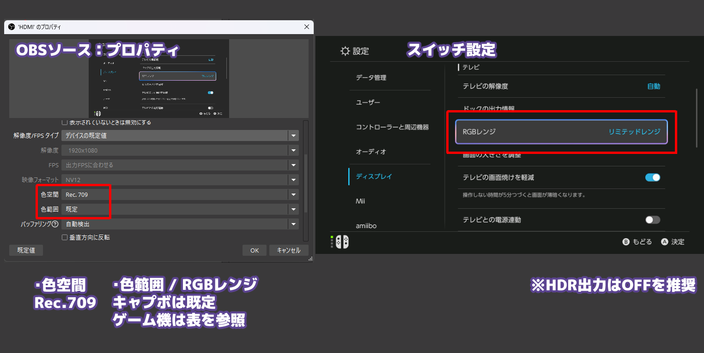
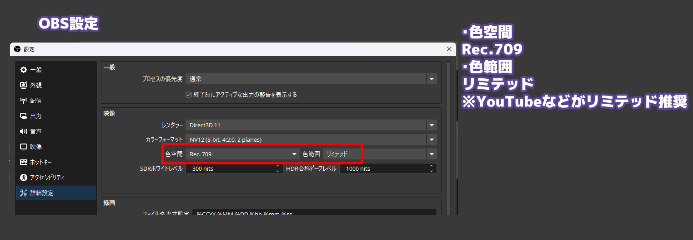

ゲーム機の映像をOBSで取り込む場合、カラーレンジを適切に設定する必要があります
設定を間違えると、映像の色が全体的に濃くなったり、逆に全体的に白っぽくなる問題が発生します


  HDRは設定が難しいため、今回はOFFを前提とします


## 基本設定

OBS側の色空間を `Rec. 709` に設定します 
カラーレンジ (色範囲 / RGBレンジ など) は 
問題が起きにくいため、リミテッドで統一するのがおすすめです 


  間違った設定を行うと **色が濃くなる / 薄くなる** といった問題が発生します 
  そのため、リミテッドで統一するのが最も手軽な設定となります


## キャプチャ設定

| 項目 | 設定の目安 |
| --- | --- |
| 色空間 | `Rec. 709` |
| 色範囲 | 下記表を参照 |
| HDR | OFF |

キャプチャーボードのフォーマットにより、うまく扱えるカラーレンジが決まります 
よくわからなければリミテッドにするのがよいです

| OBSで選択されている形式 | ゲーム機側の推奨 |
| --- | --- |
| NV12 | リミテッド |
| YUY2 | リミテッド |
| I420 | リミテッド |
| XRGB | フルも使用可能 |
| RGB・BGRA・BGRX | フルも使用可能 |
| MJPEG | キャプチャーボード依存のためリミテッドが安全 |

## 出力設定

配信サイトの推奨値と設定を合わせる必要があります 
配信サイト側がリミテッドレンジに変換しているとの情報もあるため、 
リミテッドレンジがおすすめです


  > YouTube はフルカラーの範囲を制限された色範囲に変換します
  https://support.google.com/youtube/answer/1722171


## 変更方法

### Switch2
設定 → ディスプレイ

| 項目 | 設定の目安 |
| --- | --- |
| RGBレンジ | キャプチャーボードの色範囲と合わせる |
| HDR | OFF |
