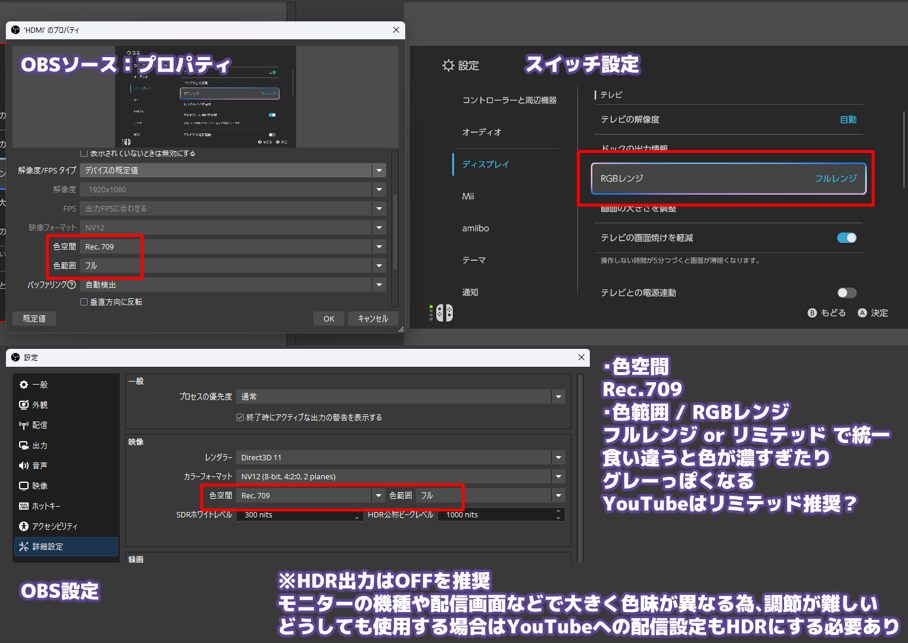

ゲーム機の映像をOBSで取り込む場合、複数設定する場所があります

- ゲーム機の映像やディスプレイ (画面) 設定
- キャプチャーデバイス
- OBSの設定

それぞれを同じ設定に統一することが重要です 
設定が食い違うと、映像の色が全体的に濃くなったり、逆に全体的に白っぽくなる問題が発生します


  HDRは色変換の扱いが難しいため、今回はHDR OFFを前提とします


## 基本設定

OBS側の色空間を `Rec. 709` に設定します 
色範囲 / RGBレンジは、接続している機器すべてで フル または リミテッド で統一してください 
一致していないと **色が濃くなる / 薄くなる** といった問題が発生します

  配信サイト側がリミテッドレンジに変換しているとの情報もあるため、 
  配信用設定はリミテッドレンジがおすすめです
  > YouTube はフルカラーの範囲を制限された色範囲に変換します
  https://support.google.com/youtube/answer/1722171


| 項目 | 設定の目安 |
| --- | --- |
| 色空間 | `Rec. 709` |
| 色範囲 | ゲーム機側のRGBレンジと同じ設定 |
| HDR | OFF |

## 変更方法

1. OBS → 設定 → 詳細設定 で 色範囲を変更
2. OBSの映像キャプチャデバイスでプロパティを開く → 色範囲を変更
3. ゲーム機のカラーレンジ設定を変更する


  フルとリミテッドが混ざらないように気を付けてください


## Switch2
設定 → ディスプレイ

| 項目 | 設定の目安 |
| --- | --- |
| RGBレンジ | OBS・キャプチャデバイスの色範囲と合わせる |
| HDR | OFF |

## 関連記事

- [OBSでのPSP取り込み設定](../psp-capture/)

