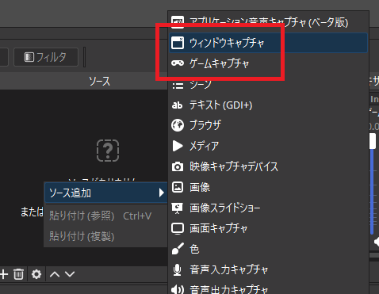
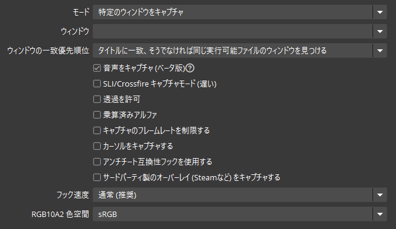
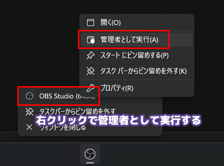
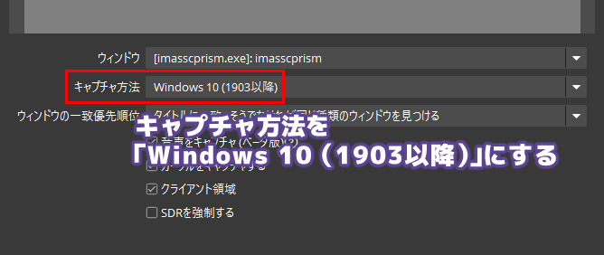
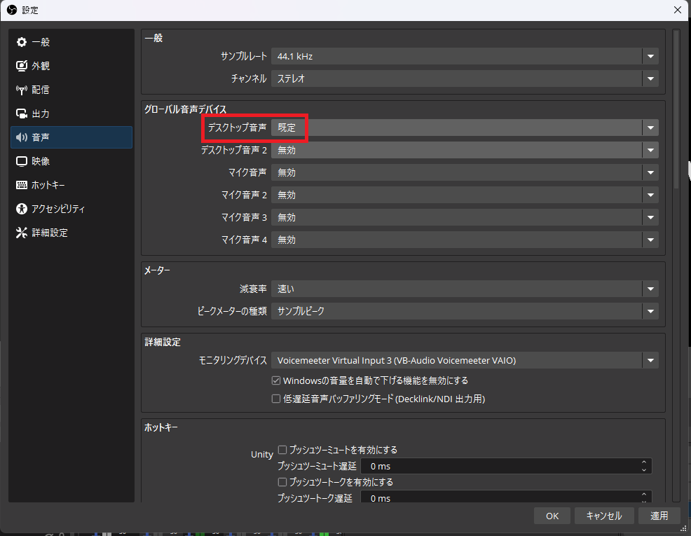

## ゲーム画面を映す

Windowsでゲームをキャプチャする方法は大まかに2種類あります
1. ゲームキャプチャ
1. ウィンドウキャプチャ

---
### ゲームキャプチャ

| 項目 | 設定 |
| --- | --- |
| モード | 特定のウィンドウをキャプチャ 古いゲームなどは「フルスクリーンアプリケーション」を選択する方がいいこともあります |
| ウィンドウ | キャプチャしたいゲーム |
| ウィンドウの一致優先順位 | タイトルに一致、そうでなければ同じ実行可能ファイルのウィンドウを見つける |
| 音声をキャプチャ (ベータ版) | 後述 |
| キャプチャのフレームレートを制限する | 「ゲームは180FPSで動いてるけど、配信は60FPSで行いたい」などの場合に OBSの負荷を下げることができるかもしれません 不安定になることもあり得ます |
| カーソルをキャプチャする | マウスカーソルを移すかの設定です。ゲームの性質やお好みで |
| サードパーティ製のオーバーレイをキャプチャする | オフ推奨 |

---
#### 映らない場合

大抵はゲームキャプチャで問題ありません 
ただし、一部のゲームでは真っ黒になってしまい、キャプチャすることができません 
その場合は以下の対策を試してください

---
- 対策1 - OBSを管理者権限で起動する

ゲームによっては管理者として実行することでキャプチャできるものがあります 
ゲームキャプチャのままキャプチャできることがメリットですが 
管理者権限で起動しないといけないため、以下のようなデメリットがあります
- 管理者権限で起動する手間
- セキュリティ面で管理者権限であること 
プラグインなどでセキュリティ的に問題があった際、トラブルの原因となりうる

---
- 対策2 - ウィンドウキャプチャでキャプチャする

ゲームキャプチャのほかにウィンドウキャプチャというものがあり、こちらは映像を映すのが比較的簡単です 
ただし、内部的な処理の問題で、OBS上 (=録画や配信画面) ではカクついて見えることがあります

---
### ウィンドウキャプチャ

ウィンドウキャプチャでなら、大抵のゲームはキャプチャできると思います 
デメリットとして、この方式ではフレームレートがゲーム画面そのままではなく、カクついて見えることがあります

| 項目 | 設定 |
| --- | --- |
| ウィンドウ | キャプチャしたいゲーム |
| キャプチャ方法 | Windows 10 (1903以降) |
| ウィンドウの一致優先順位 | タイトルに一致、そうでなければ同じ実行可能ファイルのウィンドウを見つける |
| 音声をキャプチャ (ベータ版) | 後述 |
| カーソルをキャプチャする | マウスカーソルを移すかの設定です。ゲームの性質やお好みで |
| クライアント領域 | チェック推奨 ウィンドウタイトルの枠を除外する設定です |

## ゲーム音をキャプチャする

こちらもおおまかに3種類あります 
ひとつはゲームキャプチャやウィンドウキャプチャの **音声をキャプチャ (ベータ版)** をしようすることです

1. ゲームキャプチャ や ウィンドウキャプチャ の **音声をキャプチャ (ベータ版)** を使用する
1. アプリケーション音声キャプチャ (ベータ版)
1. デスクトップ音声を乗せる

---
### 音声をキャプチャ (ベータ版)

ゲームキャプチャやウィンドウキャプチャで指定したウィンドウのみの音が乗ります 


  長時間使用していると、ノイズが載ることがあるようです 
  これはWindows側の問題とのことで、OBS開発チームとしては対応予定はないらしいです 
  https://github.com/obsproject/obs-studio/issues/8064  
  https://github.com/obsproject/obs-studio/issues/13175


---
### アプリケーション音声キャプチャ (ベータ版)

音声をキャプチャ (ベータ版) の単体版です

---
### デスクトップ音声を乗せる

自分に聞こえてくる音をすべて載せます 
そのため、Discordの通知音やシステムのポップアップ音、YouTubeを再生すればその音なども乗ってしまいます 


  音が載らないトラブルは起こりにくいですが、逆に音が載りすぎてしまう問題があります 
  たとえば、歌枠配信で原曲を確認したり、マイクラ配信で参考動画を再生したりすると、音が載ってしまいます 
  使用する場合は十分に気を付けてください


なお、完全にオフにすることも可能です

