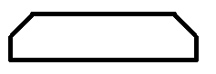
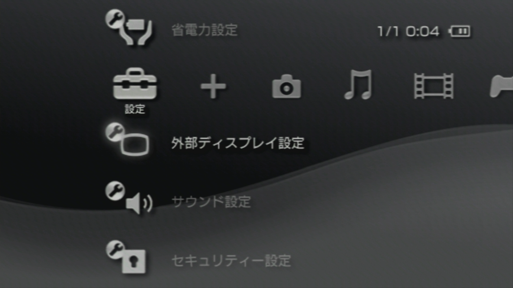
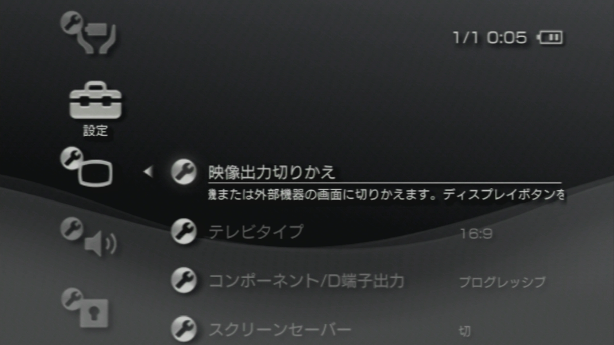
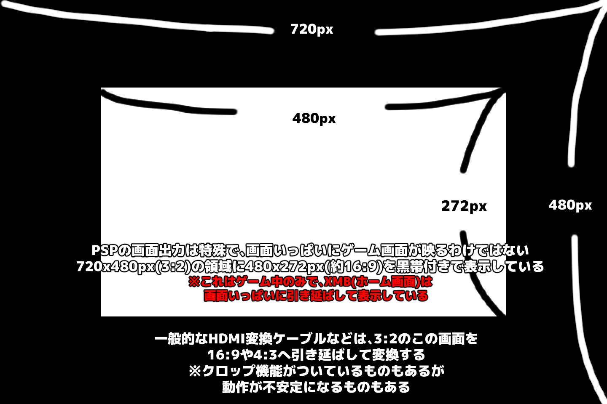
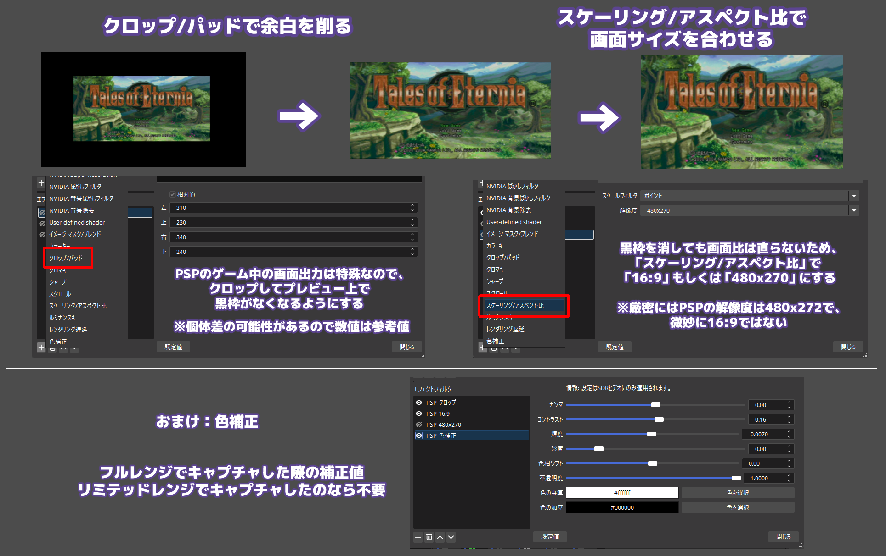

ゲーム中のPSPの外部出力は、一般的な16:9映像のように画面いっぱいには表示されません 
映像内に黒枠が付くため、ゲーム画面のみを切り出した後、表示サイズを調整してください

## キャプチャ方法

PSPのキャプチャは、そのままではSwitchなどのようにHDMIで行うことができません 
専用の端子から映像出力を行う為、専用のケーブルが必要になります 

また、PSPは世代によってゲームが外部出力できるか変わります

| ケーブル | 1000 | 2000 | 3000 | Go |
| --- | --- | --- | --- | --- |
| D端子 | ✖ | ● | ● | ● |
| コンポーネント | ✖ | ● | ● | ● |
| S端子 | ✖ | ✖ | ● | ● |
| コンポジット(RCA)端子 | ✖ | ✖ | ● | ● |

D端子 / コンポーネント端子を前提に説明を進めます 
※PSP-2000対応のHDMI変換ケーブルは、内部的にはD端子やコンポーネント端子と思われます

PSP-2000の説明
https://manuals.playstation.net/document/jp/psp/current/settings/aboutvo.html  
PSP-3000 / PSP goの説明
https://manuals.playstation.net/document/jp/psp/current/settings/aboutvo_3000.html  

また、変換ケーブルの場合は、micro USBによる電源供給が必要なことがあります  

こんな形のやつ

---
### 事前設定

映像出力の設定は 設定 → 外部ディスプレイ設定 にまとまっています

| 項目 | 推奨値 |
| --- | --- |
| コンポーネント/D端子出力 | プログレッシブ |
| ちらつき低減 | 入 |

これらはちらつきを抑えるための設定となります

---
### 画面出力モードにする方法

公式ヘルプ https://manuals.playstation.net/document/jp/psp/current/settings/switchvo.html

PSPから画面出力を開始する方法は2つあります
- XMB (ホーム画面) の設定 → 外部ディスプレイ設定 →映像出力切り替え 

- ディスプレイボタン (□マーク) を5秒以上長押しする 
※ディスプレイ下側の PSPロゴ と ♪マーク の間にあります

## PSPの出力レイアウト

PSPのゲーム画面は、720×480の映像内に480×272 (PSPの解像度) 相当のサイズで配置されます 
余白を含む画面全体をそのまま拡大すると、黒枠も一緒に引き伸ばされてしまいます 

XMB (ホーム画面) では画面いっぱいに表示されます 
調整はゲームを起動しながら行ってください


### OBSで黒枠を削る

OBSのソースを右クリックし、「フィルタ」から「クロップ・パッド」を追加します 
プレビューを確認しながら、上下左右の黒枠が見えなくなるまでクロップしてください


画像内の数値は目安です 
ケーブルの個体差の可能性があるため、実際の映像に合わせて調整してください


### 表示サイズと比率を整える

1. **黒枠を削る**  
   プレビューで黒枠が見えなくなるまで「クロップ・パッド」を調整します
2. **サイズを合わせる**  
   黒枠を消してから、16:9または480×270を目安にスケーリングします 

   PSPの解像度は480×272のため、完全な16:9ではありません 
   ただしキャプチャ方法の都合上、厳密なピクセル数ではなくなるため 
   違和感のない比率に調整する程度に考えてください


## 色を補正する (必要な場合だけ) 
   外部出力とモニターでは色味が異なることがあります 
   しかし、PSPは外部出力中は画面が真っ黒になるため、画面と見比べて調整することができません 
   色補正を切った画面を画像として取り込み、実機と比べながら色補正をするとやりやすいです

## 関連記事

- [OBSのカラーレンジ設定](../color-range/)

