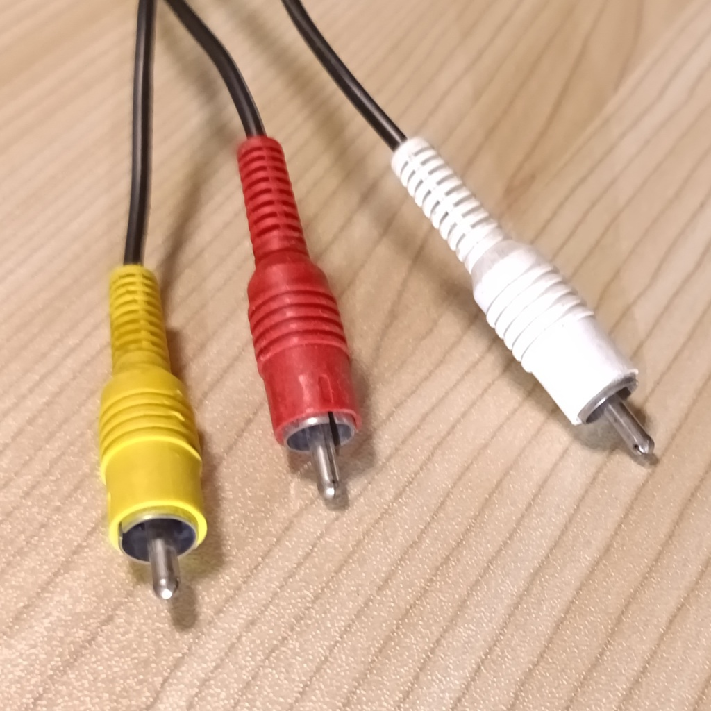
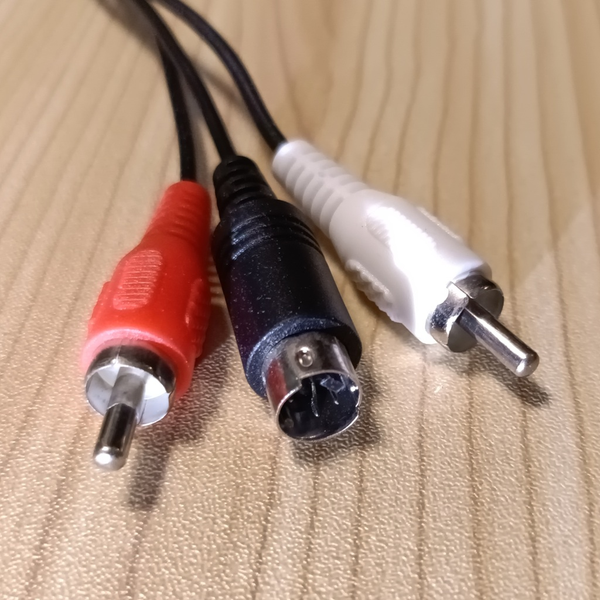
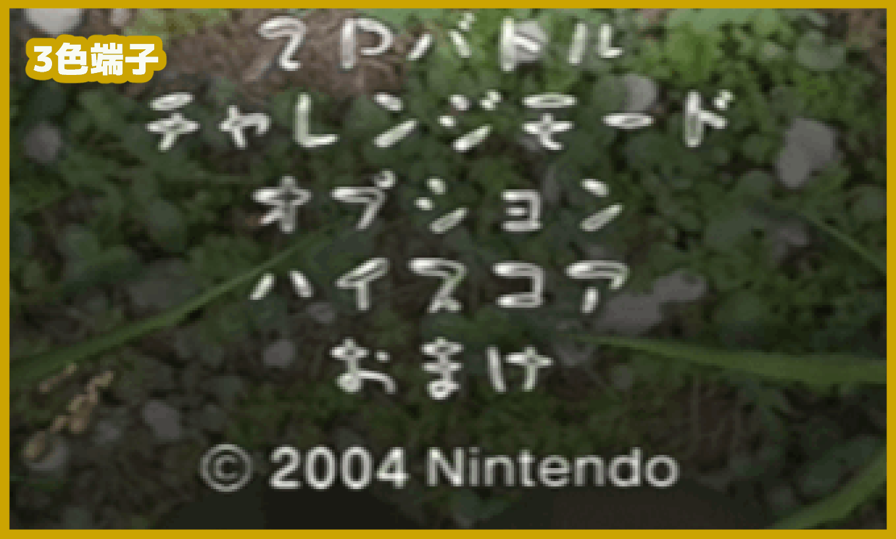
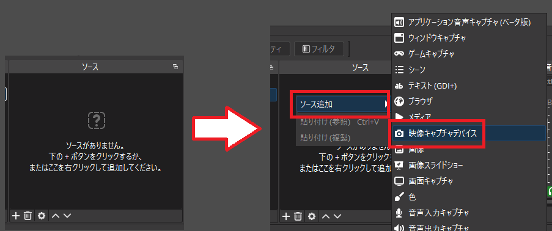
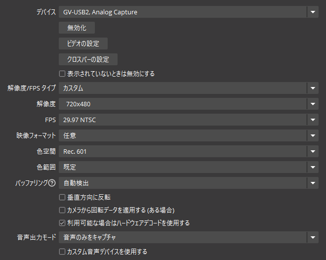
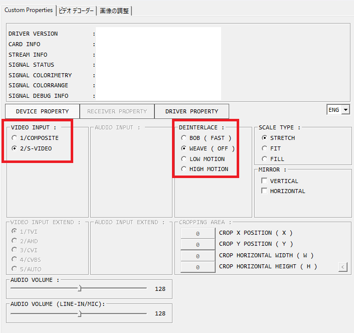
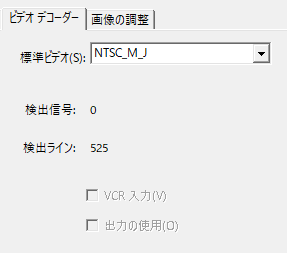
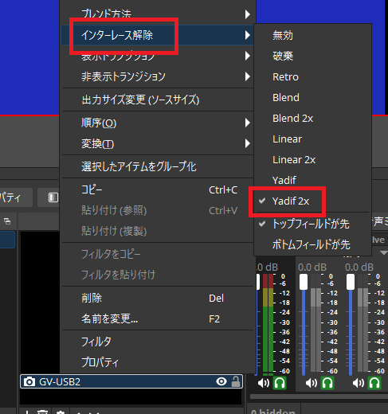

黄・白・赤の3色端子、またはS端子を使うゲーム機の映像と音声を、キャプチャーデバイス経由でOBSへ取り込む設定です 
基本は **720×480で取り込み、OBS上で4:3や16:9に整えます** 
720x480で取り込むのは、レトロゲームの出力解像度の影響です

## 必要なもの

- 3色端子もしくはS端子で出力できるゲーム機
| 3色端子ケーブル | S端子ケーブル |
| --- | --- |
|  |  |

- 3色端子・S端子対応のキャプチャーデバイス
- ゲーム機に対応した3色端子ケーブル、またはS端子ケーブル

## 接続

| ゲーム機側 | キャプチャーデバイス側 |
| --- | --- |
| 黄 | コンポジット映像入力 |
| S端子 | Sビデオ入力 |
| 白 | 音声入力 L (左) |
| 赤 | 音声入力 R (右) |

映像は黄色のコンポジット端子、またはS端子のどちらか一方を接続します 
S端子を使用すると、コンポジット端子より輪郭がはっきりした映像になります

### ピクミン2 ・ ニンテンドーゲームキューブ実機での3色端子とS端子の比較

<video autoplay loop muted playsinline controls preload="metadata" width="560" style="display: block; max-width: 100%; height: auto; margin: 0 auto;" aria-label="3色端子とS端子で取り込んだゲーム画面の比較">
  <source src="compare-capture-av1.webm" type='video/webm; codecs="av01"'>
  <source src="compare-capture-h264.mp4" type='video/mp4; codecs="avc1.640028"'>
  お使いのブラウザは動画再生に対応していません。
</video>

## OBSの設定

ソースの追加から「映像キャプチャデバイス」を選び、接続した製品を指定します

追加するとプロパティが表示されます

| 項目 | 設定 |
| --- | --- |
| デバイス | 接続したキャプチャーデバイス |
| 解像度/FPSタイプ | カスタム |
| 解像度 | 720×480 |
| FPS | 29.97 NTSC |
| 映像フォーマット | 任意 |
| 色空間 | Rec. 601 |
| 色範囲 | 既定 |
| バッファリング | 自動検出 |
| 音声出力モード | 音声のみをキャプチャ |

## キャプチャーデバイスの設定

OBSの映像キャプチャデバイスのプロパティから「ビデオの設定」を開きます
![[ビデオの設定を開く]](open-video-setting.png)

使用するケーブルに応じて、黄色端子(コンポジット)もしくはS端子を選んでください 
※表示される画面や項目名は、使用するキャプチャーデバイスによって異なる可能性があります

| 項目 | 設定 |
| --- | --- |
| VIDEO INPUT | 黄色の端子は `1/COMPOSITE` S端子は `2/S-VIDEO` |
| DEINTERLACE | `WEAVE ( OFF )` |
| SCALE TYPE | `STRETCH` |

続けて「ビデオ デコーダー」タブを開き、標準ビデオを `NTSC_M_J` にします 


  同じケーブルでも日本と海外では映像の色味が異なります 
  `NTSC_M_J` とすることで、日本向けの色味として扱います


## 画面比率を整える

720×480をそのまま表示すると横長になるため、「スケーリング/アスペクト比」フィルターで調整します

1. キャプチャーデバイスのソースを右クリックする
2. 「フィルタ」を開く
3. エフェクトフィルタの「＋」から「スケーリング/アスペクト比」を追加する
4. 解像度をゲームの表示比率に合わせる

| 表示比率 | 解像度 |
| --- | --- |
| 4:3 | `640×480` |
| 16:9 | `854×480` |

## インターレース解除

動いている部分に横縞が見える場合は、OBS側でインターレース解除を行います 
キャプチャーデバイス側の `DEINTERLACE` は `WEAVE ( OFF )` にしてください

1. キャプチャーデバイスのソースを右クリックする
2. 「インターレース解除」から `Yadif 2x` を選ぶ
3. フィールド順序を「トップフィールドが先」にする

映像が上下にぶれる場合は「ボトムフィールドが先」を試してください

## 映らない・音が出ない場合

### 映像が出ない

- キャプチャーデバイスを使用している別のソフトを終了する
- 接続した端子とVIDEO INPUTの設定が合っているか確認する
- セキュリティソフトによるカメラへのアクセスを許可する
- USBハブを使わずにPCへ直接接続してみる

### 音が出ない

- 赤と白の音声ケーブルを確認する
- OBSの音声ミキサーにキャプチャーデバイスが表示されているか確認する
- Windowsのマイクへのアクセスを許可する

## 関連記事

- [OBSのカラーレンジ設定](../color-range/)
- [PSPのキャプチャ方法](../psp-capture/)
