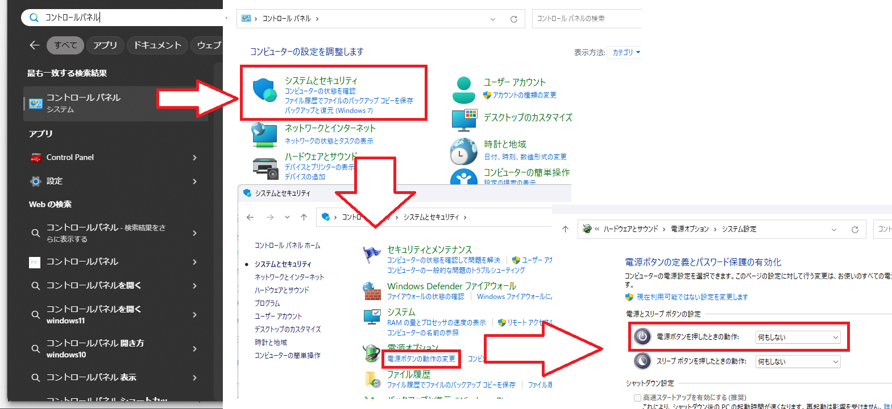

PCの電源ボタンを間違えて押しても、シャットダウンされないように設定できます

## 設定方法

1. コントロール パネルを開く
2. **システムとセキュリティ** を選択
3. 電源オプションの **電源ボタンの動作の変更** を選択
4. **電源ボタンを押したときの動作** を **何もしない** に変更
5. **変更の保存** を選択

ノートPCでは、**バッテリ駆動** と **電源に接続** の両方を **何もしない** に変更してください


  この設定を行っても、スタートメニューからシャットダウンできます


## 元に戻す方法

同じ設定画面を開き、**電源ボタンを押したときの動作** を **シャットダウン** に戻してください
